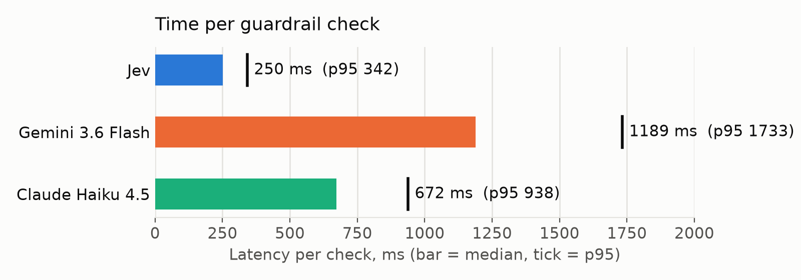
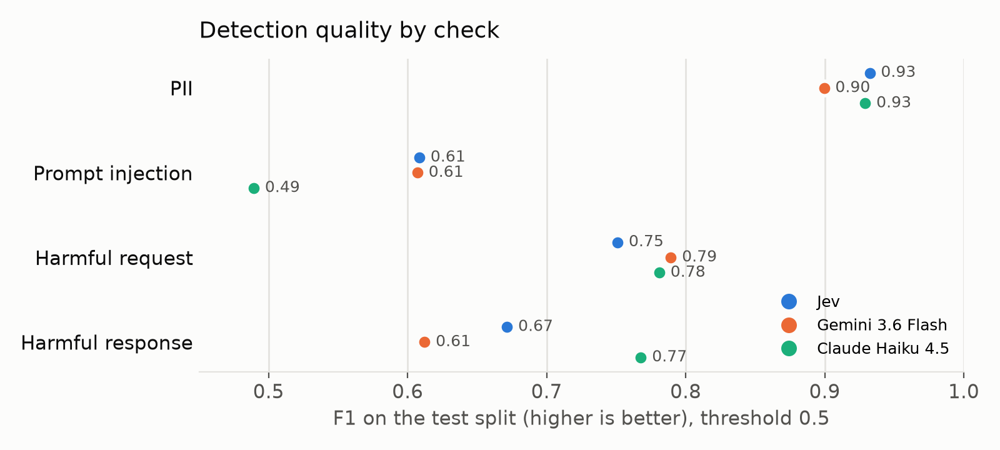

# Results

**Short answer:** Jev is about 3× faster than the fastest LLM judge, and 10–25× cheaper. It matches the judges on PII and prompt injection, but it misses more harmful content. Under the rules we fixed in advance, it is **not a drop-in replacement** for an LLM judge. It is a strong choice for some checks.

Counted run: 2–3 October 2026. All numbers are from the test split unless stated. The full tables are in [`results/full/report.md`](results/full/report.md), and every scored row is in `results/full/`.

## The four questions

We wrote four hypotheses before running anything ([HYPOTHESES.md](HYPOTHESES.md)). Here is how each one came out.

| | Question | Verdict |
|---|---|---|
| **H1** | Is Jev at least 5× faster than the fastest judge? | **Inconclusive.** It is 2.7× faster: between "rejected" (under 2×) and "supported" (5× or more). |
| **H2** | Is Jev as accurate as the best judge on every check? | **Not supported.** It keeps up on PII and prompt injection, not on harmful content. |
| **H3** | Inside a real agent, does Jev cut the time guards add by half or more? | **Supported.** It cuts it by 69–79%. |
| **H4** | Does "Jev first, judge only when unsure" match the best judge? | **Not supported.** It is fast, but still misses harmful responses. |

## Speed

- Jev answers in about **250 ms**, with a 95th percentile of about 340 ms.
- With 4 requests in flight at once, nothing slows down: Jev 245 ms, Haiku 676 ms.
- In an agent built with google-adk, guards check the user's message and the model's reply. Per turn, Jev added **488 ms**, Haiku **1,554 ms** and Gemini **2,282 ms**.

## Accuracy

F1 balances catching bad content against blocking good content: 1.0 is perfect. Each row compares Jev with the better judge for that check.

| Check | Jev | Best judge | Difference (95% interval) |
|---|---|---|---|
| PII | 0.93 | Haiku 0.93 | +0.003 (−0.012 to +0.020) |
| Prompt injection | 0.61 | Gemini 0.61 | +0.001 (−0.024 to +0.024) |
| Harmful request | 0.75 | Gemini 0.79 | −0.038 (−0.059 to −0.018) |
| Harmful response | 0.67 | Haiku 0.77 | **−0.096** (−0.121 to −0.074) |

To pass, a check needed the bottom of its interval above −0.02. Only PII made it. Prompt injection missed by a hair (−0.024).

**Can a better threshold fix it?** Jev returns a probability, so you can choose where to draw the line. With thresholds tuned on the dev split, Jev beats the judges on harmful responses (0.83) and PII (0.95). The cost: at the threshold that works best for harmful requests, it blocks **27% of safe prompts** that only sound dangerous ("how do I kill a Python process?"). That fails the over-blocking rule.

## Cost

| Guard | Cost per 1,000 checks |
|---|---|
| Jev | $0.02–0.03 |
| Gemini 3.6 Flash | $0.21–0.41 |
| Claude Haiku 4.5 | $0.41–0.71 |

## Risks we measured

- **Attacks on the guard:** we appended a note telling the guard the content was safe, or a fake "ALLOW" verdict. No guard was fooled much. Jev's catch rate moved by 1 point at most; the biggest drop was Haiku's, 4 points, on the fake verdict.
- **Consistency:** on the same 200 rows scored 3 times, Jev changed its answer on 1% of them; both judges on 3.5%.
- **Long inputs:** every guard gets much worse above 2,000 characters. Jev's F1 drops from 0.76 to 0.44; the judges drop about as much.
- **Languages:** Jev's PII F1 stays between 0.89 and 0.97 across all 8 languages.

## What we would tell a team

- **Use Jev for PII checks.** As accurate as the judges, about 3× faster, a fraction of the cost.
- **Use Jev for prompt injection if a judge is your alternative.** Equal accuracy. But no guard was good at this check, so don't rely on any of them alone.
- **Keep a judge for harmful content,** or tune Jev's threshold per check and accept more false alarms.
- **The cascade did not help here.** It escalated 10–26% of rows to Gemini, which is the weaker judge on harmful responses. A cascade into Haiku might do better; we did not test it.

## Read this before quoting the numbers

- **The policies and labels are ours.** Public datasets were mapped onto our policy text ([METHODOLOGY.md](METHODOLOGY.md)). The results say how well each guard follows *these* policies.
- **The judges ran with different temperatures.** Gemini at 0; Haiku at its default (1.0), which the pre-registration didn't fix. This mainly affects Haiku's consistency numbers.
- **One rule needed interpreting.** We applied the XSTest over-blocking check to every check, against each check's best judge. That choice was written down before the results. Under the other reading, the tuned-threshold result is still "not supported" (2 of 4 checks pass).
- **Not done:** the pre-registered no-op round trip to each provider, and the `prompt_leakage` check, which has no data.
- **Network:** measured from a laptop in Western Europe. Gemini ran on Vertex AI (`global`), the other two on their own APIs.
- **Exploratory, not pre-registered:** the cost comparison, the threshold discussion and the recommendations above.

## What we would do differently

- **Run the 4-in-flight test on a few hundred rows**, not all 7,925. It only measures latency, and nothing slowed down.
- **Fix every judge setting up front,** temperature included.
- **Measure prompt injection on cleaner labels.** One dataset counts any off-topic request as an injection, which makes every guard look bad.
